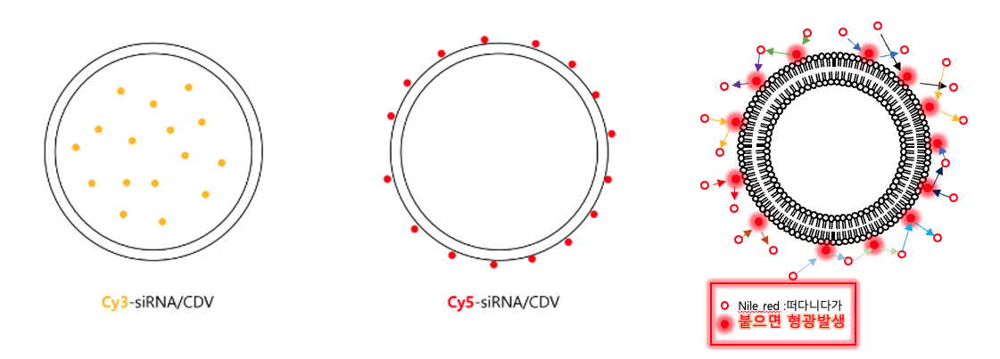
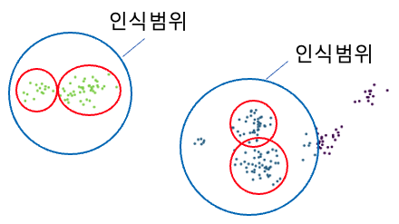
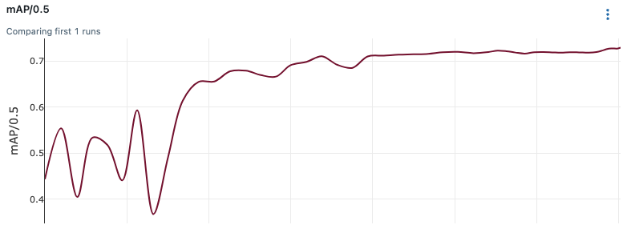
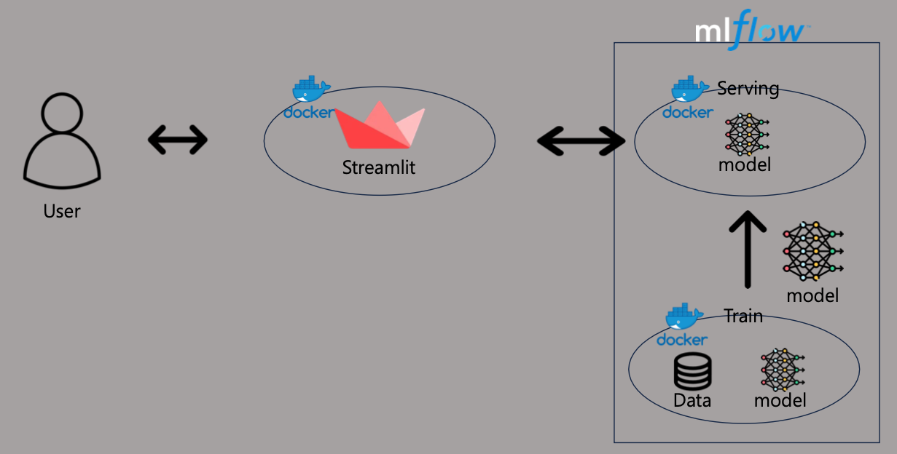

# MLOps -  CDV Detection Model

## ⭐️ Project Introduce

한양대학교 [STORM LAB](https://doorykimlab.wixsite.com/spectromicroscopylab)의 요청으로 제공된 데이터를 통하여 객체 검출 모델을 훈련하고 배포하였습니다.

emccd 카메라를 통하여 촬영된 이미지에서 CDV라 불리는 exosome-like한 물질로 예상되는 물질의 위치를 찾는 것을 목표로 합니다.

CDV라 예상되는 물질의 위치정보를 알면 후처리 기능을 이용하여 검증이 가능합니다. 기존에는 사람이 직접 물질의 예상 위치정보를 찾는데 많은 시간과 노동이 필요하였습니다. 인공지능 모델을 통하여 사람의 노동과 시간비용을 줄일 수 있을것으로 보여집니다.

## Index
* [Model](#Model)
* [Project Structure](#📈-Project-Structure)
* [Demo Video](#🎥-Demo-Video)
* [Command](#Command)
* [TODO](#TODO)

## Model

한양대학교 [STORM LAB]에서 DBSCAN을 활용하여 CDV라 예상되는 물질을 검출하려 하였으나 붉은 원 안의 물질은 서로 다른 물질이지만 하나의 물질로 인식하는 한계점이 있었다. \
이러한 한계점을 극복하기 위하여 YOLO모델을 활용하기로 결정 하였다.
---

### 모델 학습 결과

|Model|Metric: mAP|Input|Output|
|:--:|:--:|:--:|:--:|
|YOLO6|0.73|이미지|CDV 예상 위치정보 (x,y,w,h)|

---

### 데이터 구조
- [Data Folder Structure](Data.md)

## 📈 Project Structure

- MLflow를 활용하여 모델을 학습하고 서버에 모델을 배포하였다.
- Streamlit을 이용하여 배포된 모델을 통하여 원하는 이미지에 대하여 결과 csv를 받을 수 있게 구성하였다.

|name|Docker File|
|:--:|:--:|
|Model Train|[Dockerfile](mlflow_model/Dockerfile)|
|Model Serving|[Dockerfile](mlflow_serving/Dockerfile)|
|Frontend|[Dockerfile](streamlit_frontend/Dokcerfile)|

---

## 🎥 Demo Video

- 사용자의 이미지를 입력 받으면 CDV라 예상되는 물질의 위치정보를 Box형태로 시각화
- conf_thres, iou_thres의 값을 유동적으로 변경하여 시각적으로 CDV의 예상위치를 확인 가능 \
이를 통하여 DBSCAN의 서로 다른 물질이지만 하나의 물질로 인식하는 문제를 해소 가능
- download 버튼을 클릭하여 원하는 정보의 csv 파일을 저장 가능

## Command

### Model Train
~~~
# mlflow_train Image
docker build -t mlflow_train -f mlflow_model/Dockerfile .

# model train
mlflow run mlflow_model -A gpus=all
~~~

### Model Serving
~~~
1. 모델 설정
mlflow ui

2. serving image build
sudo docker build -t mlflow_serving --build-arg LOCAL_PATH={mlrun_path} -f mlflow_serving/Dockerfile .

3. docker run
sh shell/serving.sh
~~~

### Frontend Streamlit
~~~
1. 이미지 생성
sudo docker build -t frontend -f streamlit_frontend/Dokcerfile .

2. 실행
sh shell/frontend.sh
~~~

## TODO
프로젝트 개선을 위해 고려해볼 것!
1. Kubernetes
2. DataBase
3. Airflow
